# python_labs

# Лабораторная работа 1
## Задание 1

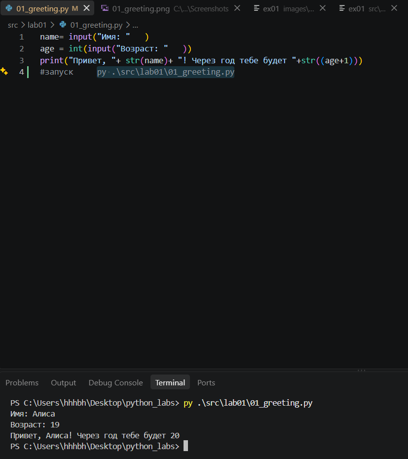

## Задание 2

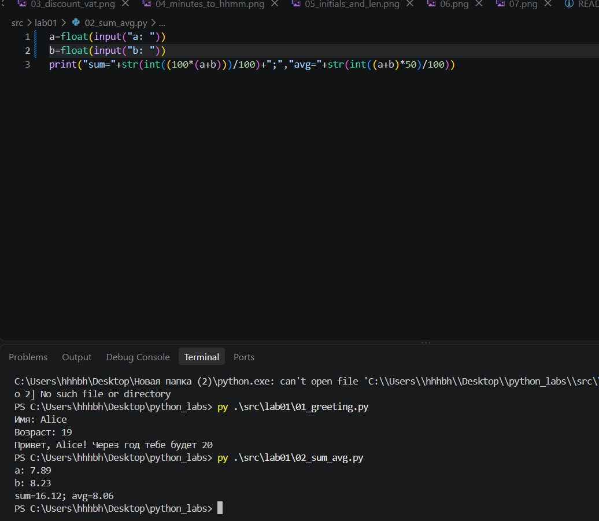

## Задание 3

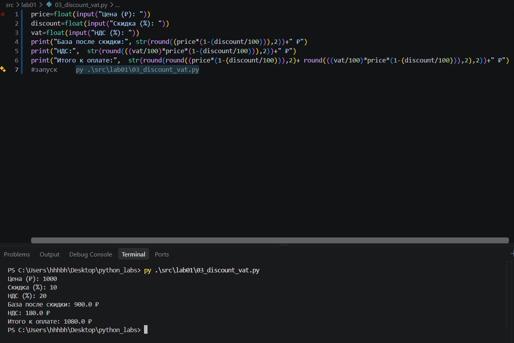

## Задание 4

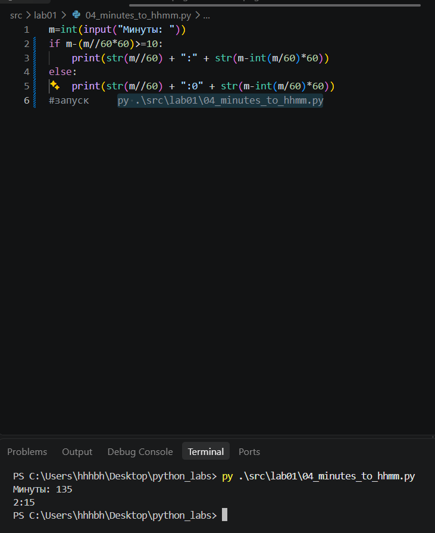

## Задание 5

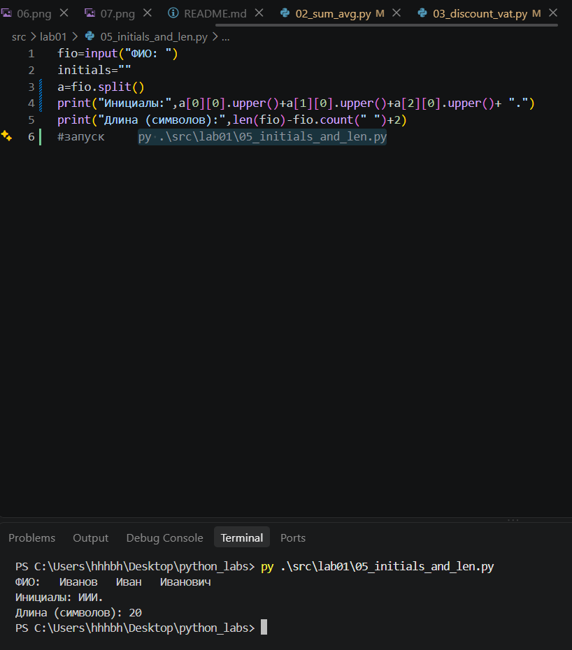

## Задание 6

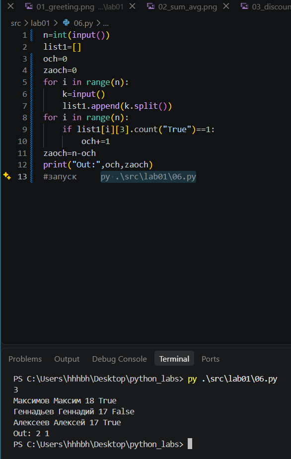

## Задание 7

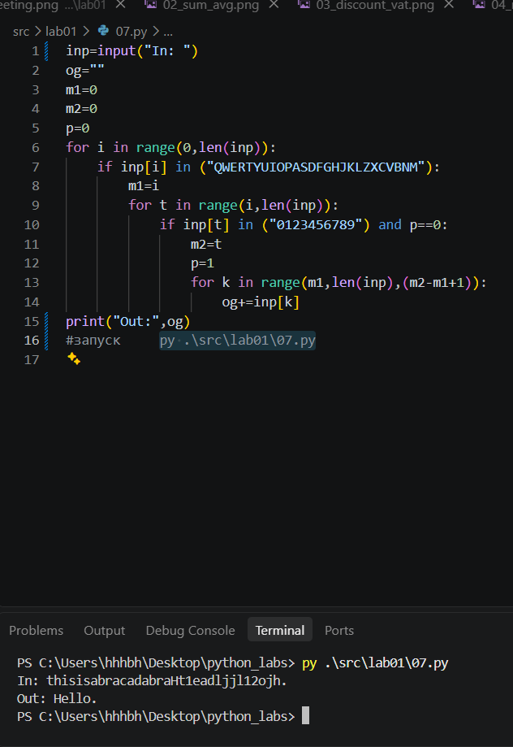

# Лабораторная работа 2
## Задание 1

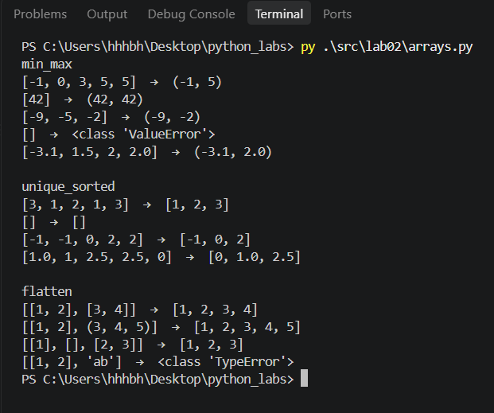

## Задание 2

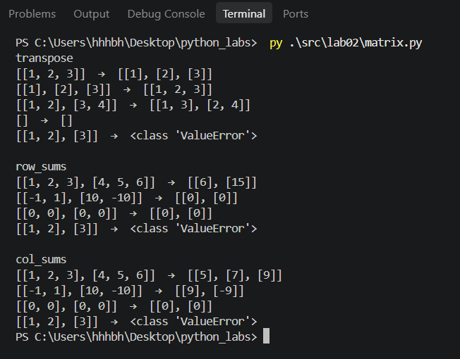

## Задание 3

ValueError выдается в случаях: неверного GPA, неверной длины имени. TypeError выдается в случаях: пустого ФИО, пустой группы, неверного типа ФИО (не буквы)
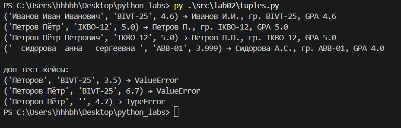

# Лабораторная работа 3
## Задание 1

Здесь лежат все функции и тес-кейсы по заданию А (пока не понял как вызывать функции из lib)
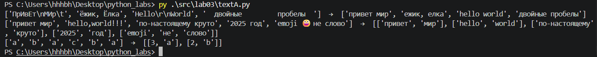

## Задание 2

Переменная k влияет на размер и наличие/отсутствие таблицы в выводе
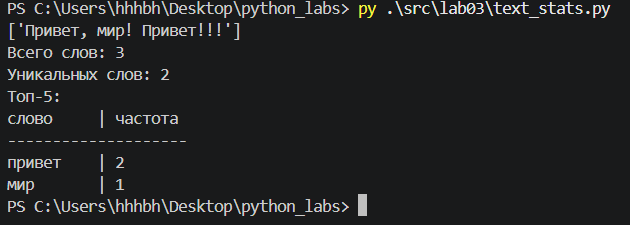